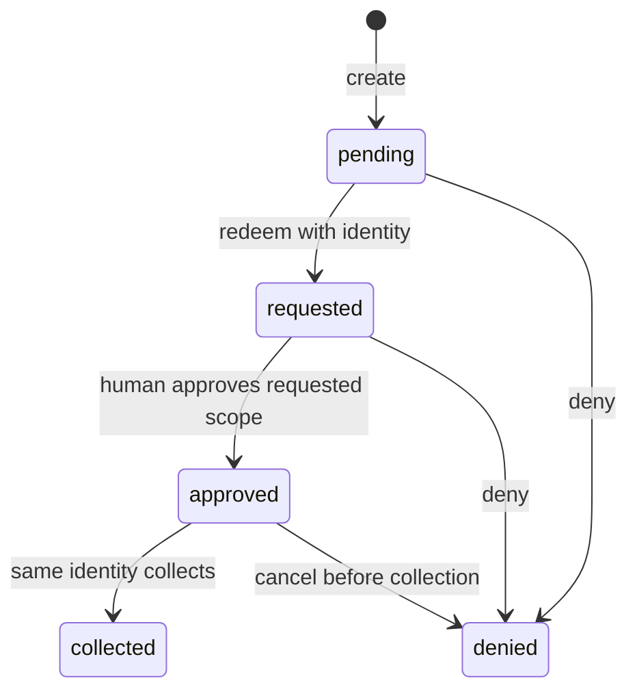

# ErisDB API reference

This is the reference for the implemented public API: all core HTTP routes
(also available over Iroh), pairing tickets, MCP tools, the Rust client, its
blocking/Android interface, and the plugin process protocol. Operator CLI
commands are indexed at the end.

The contract is checked against [the router](../erisdb/src/api.rs),
[installation authentication](../erisdb/src/installation.rs),
[the MCP bridge](../erisdb-mcp/src/main.rs), and
[the native client](../erisdb-client/src/lib.rs). Examples use illustrative IDs,
timestamps and credentials; obtain real values from your running core.

## Contents

- [Conventions and authentication](#conventions-and-authentication)
- [Example setup](#example-setup)
- [Objects](#objects)
- [Permissions by route](#permissions-by-route)
- [Errors](#errors)
- [Health and server state](#health-and-server-state)
- [Items and facets](#items-and-facets)
- [Change feed and ticks](#change-feed-and-ticks)
- [Capabilities and permissions](#capabilities-and-permissions)
- [Pairing](#pairing)
- [Registered installations](#registered-installations)
- [Plugins](#plugins)
- [MCP tools](#mcp-tools)
- [Rust client API](#rust-client-api)
- [Blocking and Android API](#blocking-and-android-api)
- [Operator CLI](#operator-cli)
- [Limits](#limits)

## Conventions and authentication

The core serves `/v1` on plain HTTP, default `127.0.0.1:7700`, and on HTTP/1.1
streams inside authenticated Iroh QUIC using ALPN `bezel/0`. The routes and
payloads are shared; transport identity affects authentication and attribution.
The old ALPN, `bezel://pair/` scheme, `bz1` token prefix and `X-Bezel-Client`
header are compatibility identifiers, not separate products.

Use HTTPS remotely, with the core behind a **local** TLS reverse proxy; HTTP is
supported on localhost. Registered HTTP access, enrollment and renewal require
the core's actual TCP peer to be loopback. Forwarded headers do not satisfy this
check. Native Iroh clients use the authenticated QUIC identity instead.

| Credential | Used for | How it is sent |
|---|---|---|
| Operator/manual token | Routes allowed by its grants | `Authorization: Bearer bz1.…` |
| Pairing capability | Redeem and poll one temporary pairing session | Same bearer header; the signed token names that session |
| Registered access token | Data and administrative routes allowed by its effective grants | Same bearer header; the signed token names its installation |
| Browser/MCP installation secret | Collect approval and renew access | `X-ErisDB-Client-Proof: SECRET`; renewal needs no bearer token |
| Native installation private key | Collect approval, access and renew | Possession is proved by the Iroh transport; never send the private key in JSON |

Only the application health route is unauthenticated. `POST /v1/clients/{id}/refresh`
authenticates with installation proof instead of a bearer token. All other
routes require a valid bearer token. HTTP registered access tokens are bearer
credentials; the independent installation secret is required for collection
and renewal, not each ordinary HTTP read/write.

For every registered request, Postgres supplies the installation's current
status and grants. Effective grants are the intersection of the token's grants
and the registration's grants. Native access additionally requires the matching
Iroh key. Missing, expired or revoked authority yields 401; insufficient grants
yield 403. Legacy/manual tokens have no installation and keep their bounded
refresh-chain semantics.

Bodies use `Content-Type: application/json`. Responses are JSON except 204,
SSE, framework rejections, and plugin-defined responses. Core responses carry
`Cache-Control: no-store`. Do not follow redirects with credentials. CORS is
permissive; possession of authority, not the browser origin, authorizes requests.
Extra fields in top-level request envelopes are ignored except for
`POST /v1/call`, which rejects them. Item bodies follow their own facet schema.
The router also supplies HEAD for GET routes and unauthenticated CORS OPTIONS
preflights. HEAD runs the GET handler but omits the response body, so do not use
HEAD on `/v1/pair/status` as a side-effect-free probe: that handler can collect
an approval. These framework methods are implicit, not additional application
operations in the route table.

`X-Bezel-Client` is an optional printable-ASCII attribution label, at most 128
bytes. It authenticates nothing. There are no cookies, query-string tokens,
HTTP PATCH operations, item upsert routes, bulk routes, or server-side search
route. MCP's `search_items` performs a bounded scan using item reads.

## Example setup

Shell examples use Bash, curl, jq, and Python 3. Point these variables at a
running development core. The creation examples write real data; use a facet
whose contract matches the example body.

```bash
BASE=http://127.0.0.1:7700
# On the operator's machine, with ERISDB_SECRET already supplied privately:
TOKEN=$(erisdb mint --grant '*' --ttl 3600)

api() {
  local method=$1 path=$2
  shift 2
  curl --fail-with-body --silent --show-error \
    --request "$method" "$BASE$path" \
    --header "Authorization: Bearer $TOKEN" \
    --header 'X-Bezel-Client: API examples' \
    --header 'Content-Type: application/json' "$@"
}
```

`TOKEN` is the acting caller's token, not the server's signing secret. App code
should use paired, narrowly granted access. Examples below assign `ITEM_ID`,
`ITEM_REV`, `SNAPSHOT_SEQ`, `PAIR_ID`, `PAIR_TOKEN`, `CLIENT_ID`, and `PROOF`
from previous responses. If using a section independently, supply its variables.
The delete example is a separate final operation; keep the item alive while
trying update, history and revert.

## Objects

### Item

An item is the durable envelope around a facet-defined JSON body. Registrations
in `clients` are separate objects, not generic items.

```json
{
  "id": "a871b3bb-a77b-4fbd-a289-6f7d04e03c3a",
  "facet": "notes",
  "body": {"title": "First note", "done": false},
  "revision": 1,
  "created_at": "2026-09-21T12:00:00Z",
  "updated_at": "2026-09-21T12:00:00Z",
  "source": {"addr": "127.0.0.1:54321", "user": null, "client": "API examples", "installation": null}
}
```

| Field | Type and meaning |
|---|---|
| `id` | Server-assigned UUID v4; immutable |
| `facet` | Registered namespace; immutable through item updates |
| `body` | JSON value checked against the facet's schema when strict; commonly an object, but the API itself accepts any JSON value |
| `revision` | Signed 64-bit integer, initially 1; increments on body updates |
| `created_at`, `updated_at` | RFC 3339 timestamps |
| `source` | JSON attribution or null for some migration-created rows |

Normal request attribution has `addr` (observed TCP peer or `iroh:ENDPOINT_ID`),
`user` (signed token label), `client` (self-declared header), and `installation`
(authenticated registration UUID). Individual values may be null. Migration
attribution can instead be an object such as `{"migration":"…"}`. Do not
assume every source has exactly the normal request fields.

Postgres stores bodies as JSONB: key ordering is not preserved and duplicate
object keys collapse. Timestamps and revisions are server-owned.

### Change and history row

```json
{
  "seq": 42,
  "item_id": "a871b3bb-a77b-4fbd-a289-6f7d04e03c3a",
  "facet": "notes",
  "op": "created",
  "at": "2026-09-21T12:00:00Z",
  "body": {"title": "First note", "done": false},
  "revision": 1,
  "source": {"addr": "127.0.0.1:54321", "user": null, "client": "API examples", "installation": null}
}
```

| Field | Meaning |
|---|---|
| `seq` | Monotonically increasing committed-feed cursor; gaps are allowed |
| `item_id` | Item UUID, or null for ticks and installation audit events |
| `facet` | Item namespace, or `system` for ticks/installation events |
| `op` | `created`, `updated`, `deleted`, `tick`, or `lapsed` |
| `at` | Database transaction timestamp, not a substitute for `seq` ordering |
| `body` | Snapshot after this change; null for deletes/ticks and some legacy migration rows |
| `revision` | Snapshot revision, or null when no snapshot exists |
| `source` | Attribution as above |

History rows contain `seq`, `op`, `at`, `body`, `revision`, and `source`; their
item ID/facet are implicit in the history request. Installation audit events use
`facet: "system"`, `item_id: null`, and body `{"event":"client","client":…}`.
Treat them as registry events, not item updates. Deletion leaves prior snapshots
in history; it does not erase audit records.

### Pairing session and installation

The pairing endpoints return a compact session envelope:
`{id, revision, created_at, body}`. The body's fields depend on its state;
[Pairing](#pairing) describes them. Generic item reads of the `pair` facet return
the full item envelope instead.

Installation objects have their own complete schema under
[Registered installations](#registered-installations).

## Permissions by route

A grant is a colon-separated pattern, for example `notes:read`, `notes:*`,
`*:read`, or `*`. Up to 64 nonempty grants are accepted, each at most 128 bytes.
Segments are `*` or lowercase `[a-z0-9][a-z0-9._-]*`. The `meta` namespace is
closed: `*:read` covers user facets, not `meta:clients:read` or other administration.
See [permission matching](permissions.md) for enclosure and wildcard rules.

| Method | Route | Required authority |
|---|---|---|
| GET | `/v1/health` | None |
| GET | `/v1/server` | `meta:server:read` |
| GET | `/v1/permissions` | Valid token |
| POST | `/v1/items` | `{facet}:create` |
| GET | `/v1/items` | `{facet}:read` |
| GET | `/v1/items/{id}` | `{facet}:read` |
| PUT | `/v1/items/{id}` | `{facet}:update` |
| DELETE | `/v1/items/{id}` | `{facet}:delete` |
| GET | `/v1/items/{id}/history` | `{facet}:read` |
| POST | `/v1/items/{id}/revert` | `{facet}:update` |
| GET | `/v1/changes` | `{facet}:read` when filtered; otherwise `meta:feed:read` |
| GET | `/v1/changes/stream` | Same feed authority |
| POST | `/v1/tick` | `meta:system:tick` |
| POST | `/v1/capabilities` | `meta:capabilities:mint`, plus grant/lifetime enclosure |
| POST | `/v1/capabilities/refresh` | Valid token |
| POST | `/v1/pairings` | `meta:pairing:create` |
| GET | `/v1/pairings` | `meta:pairing:read` |
| GET | `/v1/pairings/{id}` | `meta:pairing:read` |
| POST | `/v1/pairings/{id}/approve` | `meta:pairing:approve`, plus requested/acting grant enclosure |
| POST | `/v1/pairings/{id}/deny` | `meta:pairing:approve` |
| POST | `/v1/pair/redeem` | Pairing capability naming one session |
| GET | `/v1/pair/status` | Pairing capability and redeemer's installation proof after redemption |
| GET | `/v1/clients` | `meta:clients:read` |
| GET | `/v1/clients/{id}` | `meta:clients:read` |
| PUT | `/v1/clients/{id}` | `meta:clients:write`, plus requested/acting grant enclosure |
| POST | `/v1/clients/{id}/revoke` | `meta:clients:revoke` |
| POST | `/v1/clients/{id}/refresh` | Installation proof; no bearer needed |
| GET | `/v1/plugins` | Valid token; filters operations by effective grants |
| POST | `/v1/call` | The selected operation's concrete permission |

For the core's facets, `facet` reads require `meta:facets:read` and its writes
require `meta:facets:write`; `pair` reads require `meta:pairing:read`; `system`
reads require `meta:system:read`. Generic writes/reverts to `pair` and `system`
are refused: use their dedicated routes. A client registry UUID is not an item ID.

## Errors

Core-handler errors use the HTTP status plus this JSON envelope:

```json
{"error":"forbidden","detail":"capability does not grant notes:create"}
```

Branch on the status and `error`; `detail` is human-readable and may change.

| HTTP | `error` | Cause |
|---|---|---|
| 400 | `bad_request` | Invalid grants, unsupported lifetime, invalid challenge/client label, expired pairing, forbidden schema reference, or invalid snapshot |
| 401 | `unauthorized` | Missing/invalid/expired token, wrong installation proof/transport, revoked/expired/missing registration, or pairing token without a session |
| 403 | `forbidden` | Missing permission or grants/lifetime outside the caller's authority |
| 404 | `not_found` | Missing item, history, pairing, or administratively requested installation |
| 404 | `plugin_not_found` | Unknown plugin or operation |
| 409 | `revision_conflict` | Stale item/installation revision or stale pairing approval anchor |
| 409 | `conflict` | Duplicate facet name or invalid pairing-state transition |
| 422 | `unknown_facet` | Write to an unregistered facet |
| 422 | `schema_violation` | Item body violates the facet contract |
| 422 | `plugin_schema_violation` | Plugin input violates its manifest schema |
| 429 | `too_many_requests` | Shared mint/refresh/installation-renewal bucket exhausted |
| 503 | `unavailable` | Change-stream or plugin-process capacity reached |
| 503 | `plugin_unavailable` | Required allowlisted plugin environment variable is absent |
| 502 | `plugin_failed` | Plugin startup, header protocol, or timeout failure before headers are committed |
| 500 | `internal` | Database/internal failure; details remain in operator logs |

Framework rejections can be plain text: malformed JSON (400), wrong/missing JSON
content type (415), missing/wrongly typed JSON fields (422), invalid UUID/query
(400), oversized body (413), unknown route (404), or unsupported method (405).
Token extraction normally precedes handler body validation; installation renewal
is the exception because it has no bearer extractor. Plugin responses can have
their own body and status, including non-JSON errors.

There is no general idempotency-key API. Retry reads as appropriate; do not
blindly retry a write after a transport failure with an unknown outcome. An
explicit core authorization 401 occurs before the mutation: a registered client
may renew once and retry. Pairing collection is specially repeatable with the
same proof while its ticket is live. Revocation is idempotent.

## Health and server state

### `GET /v1/health`

No authentication or parameters. **200** `{"ok":true}`. This is process
liveness, not a database connectivity probe.

```bash
curl --fail-with-body --silent --show-error "$BASE/v1/health"
```

### `GET /v1/server`

Requires `meta:server:read`. No parameters. **200**:

```json
{
  "version":"0.1.0","feed_head":42,"facets":4,"items":8,"changes":42,
  "limits":{"streams":32,"streams_free":32,"iroh_connections":64,"client_name":128}
}
```

```bash
api GET /v1/server
```

Counts include core items/history. `feed_head` is zero for an empty feed and is
not necessarily equal to `changes` (the row count). `streams_free` is per replica.

## Items and facets

### `POST /v1/items`

Body: required `facet: string` and `body: JSON`. Requires create authority on that
facet. **201** returns an [Item](#item). There is no client-chosen ID or upsert.

Register a namespace through the same route, with `meta:facets:write`:

```bash
api POST /v1/items --data '{
  "facet":"facet",
  "body":{"name":"notes","version":1,"strict":true,
    "schema":{"type":"object","required":["title"],
      "properties":{"title":{"type":"string"},"done":{"type":"boolean"}},
      "additionalProperties":false}}
}'
```

A facet name is one lowercase permission segment, not `notes/v1` or `*`.
The built-in meta-facet accepts these registration body fields and rejects others:

| Field | Required / default | Meaning |
|---|---|---|
| `name` | Required | Unique namespace; reserved core names cannot be registered by an app |
| `schema` | Required object | JSON Schema for item bodies; `{}` accepts any JSON value |
| `strict` | Default true | Enforce the schema on writes |
| `version` | Optional integer ≥ 1 | Contract metadata; does not change the namespace or migrate existing items |
| `permissions` | Optional object | Action → human-readable description, for example `{"create":"Add notes"}` |
| `lapse` | Optional object | Required `due` field name, optional `done` field name; the tick sweep uses them |

Local `$ref` values are supported; external references are refused. Changing a
schema affects subsequent writes, not a retroactive rewrite of existing items.
See [facet contracts](facets.md) for schema and lapse examples.
If `notes` already exists, read its contract instead of registering it twice (409).

```bash
ITEM_JSON=$(api POST /v1/items --data \
  '{"facet":"notes","body":{"title":"First note","done":false}}')
ITEM_ID=$(jq -r '.id' <<<"$ITEM_JSON")
ITEM_REV=$(jq -r '.revision' <<<"$ITEM_JSON")
printf '%s\n' "$ITEM_JSON"
```

Missing registration yields 422 `unknown_facet`; schema mismatch yields 422
`schema_violation`. Creating `pair` or `system` through this route is refused.

### `GET /v1/items`

Requires read authority for the named facet. **200** `{"items":[ITEM,…]}`.

| Query | Required | Default / behavior |
|---|---|---|
| `facet` | Yes | Exactly one namespace |
| `updated_since` | No | RFC 3339; `updated_at` strictly greater than this timestamp |
| `limit` | No | Integer, default 100, clamped to 1–1000 |

```bash
api GET '/v1/items?facet=notes&limit=100'
api GET '/v1/items?facet=facet&limit=1000'
```

Rows are ordered by `(updated_at, id)`, ascending. An empty or unknown facet
returns an empty list if authorized. There is no offset or item-list cursor.
A timestamp-only continuation can miss ties; use the sequence-based change feed
for complete synchronization of large facets. URL-encode query values; in
particular encode `+` in timezone offsets or use `Z` timestamps.

### `GET /v1/items/{id}`

Requires read authority on the item's facet. **200** Item; **404** if missing;
**403** if the item exists but the caller lacks its facet permission.

```bash
api GET "/v1/items/$ITEM_ID"
```

### `PUT /v1/items/{id}`

Requires update authority. Body: required `body: JSON`, `revision: integer`.
This replaces the **whole body**; omitted fields disappear. **200** returns the
updated Item with an incremented revision. A stale revision yields **409**.

```bash
ITEM_JSON=$(api PUT "/v1/items/$ITEM_ID" --data \
  "$(jq -nc --argjson revision "$ITEM_REV" \
    '{revision:$revision,body:{title:"Edited note",done:false}}')")
ITEM_REV=$(jq -r '.revision' <<<"$ITEM_JSON")
```

The facet stays fixed. Read first, preserve the fields you intend to keep, and
handle 409 by reading the current value and resolving the concurrent edit.

### `DELETE /v1/items/{id}`

Requires delete authority. Optional integer query `revision` makes deletion
conditional. **204** has no body. Missing item yields **404**; a supplied stale
revision yields **409**. Without `revision`, the current item is deleted.

```bash
# Run after the history/revert examples if trying the full item lifecycle.
api DELETE "/v1/items/$ITEM_ID?revision=$ITEM_REV"
```

Prior bodies remain in history. Generic deletion cannot remove pairing or
system records, and it does not revoke an installation.

### `GET /v1/items/{id}/history`

Requires read authority on the original facet. No query parameters or pagination.
**200** `{"history":[HISTORY_ROW,…]}`, ordered by `seq`, oldest first. Works after
deletion; **404** means no history exists for that ID.

```bash
HISTORY_JSON=$(api GET "/v1/items/$ITEM_ID/history")
SNAPSHOT_SEQ=$(jq -r '.history | map(select(.body != null)) | first | .seq' <<<"$HISTORY_JSON")
printf '%s\n' "$HISTORY_JSON"
```

### `POST /v1/items/{id}/revert`

Requires update authority. Body: required `seq: integer`, `revision: integer`.
Writes the chosen historical body as a new revision; history never rewinds.
**200** Item. The item must still exist (404 otherwise). A sequence belonging
to another item or a null snapshot is **400**; stale revision is **409**. The
snapshot must satisfy the facet's **current** schema (422 otherwise).

```bash
ITEM_JSON=$(api POST "/v1/items/$ITEM_ID/revert" --data \
  "$(jq -nc --argjson seq "$SNAPSHOT_SEQ" --argjson revision "$ITEM_REV" \
    '{seq:$seq,revision:$revision}')")
ITEM_REV=$(jq -r '.revision' <<<"$ITEM_JSON")
```

## Change feed and ticks

### `GET /v1/changes`

With `facet`, requires read authority on that facet; without it requires
`meta:feed:read`. **200** `{"changes":[CHANGE,…],"next":42}`.

| Query | Default / behavior |
|---|---|
| `since` | Integer, default 0; only `seq > since` |
| `facet` | Optional single namespace; absent means global feed |
| `limit` | Integer, default 500, clamped to 1–5000 |

```bash
PAGE=$(api GET '/v1/changes?facet=notes&since=0&limit=500')
CURSOR=$(jq -r '.next' <<<"$PAGE")
api GET "/v1/changes?facet=notes&since=$CURSOR&limit=500"
```

`next` is the last returned sequence, or the supplied `since` when empty. Apply
rows in sequence order and persist the last processed cursor. Filtered feeds
have gaps because other facets share the sequence. Item deletion is a tombstone;
`lapsed` carries a snapshot without changing the item's revision.

### `GET /v1/changes/stream`

Same authorization and `since`/`facet` semantics. The query parser accepts
`limit`, but streaming ignores it and drains internal batches of 500.
**200** `Content-Type: text/event-stream`:

```text
event: change
data: {"seq":42,"item_id":"a871b3bb-a77b-4fbd-a289-6f7d04e03c3a","facet":"notes","op":"created","at":"2026-09-21T12:00:00Z","body":{"title":"First note","done":false},"revision":1,"source":null}

```

```bash
api GET '/v1/changes/stream?facet=notes&since=0' --no-buffer
```

The stream catches up, then waits for new changes. Keepalive comments can appear.
It sends no SSE `id` or `retry` field and does not consume `Last-Event-ID`; reconnect
with the last processed `seq` in `since`. Browser clients need a streaming fetch
that can set the bearer header (native EventSource cannot set it).

Expiry, loss of feed permission, revocation, or backend failure closes the stream;
an already-started response cannot become a new HTTP error. Registered authority
is rechecked before each event, and registry notifications wake idle streams across
replicas. Reconnect after renewal if still authorized. Capacity exhaustion before
stream creation yields **503**. Already delivered events are not retracted.

### `POST /v1/tick`

Requires `meta:system:tick`. Takes no body. **200** `{"seq":43,"lapsed":0}`.

```bash
api POST /v1/tick
```

`seq` identifies the tick row, not necessarily the final feed head. In one
transaction the core appends a system tick and emits `lapsed` changes for overdue,
unfinished items in facets declaring lapse rules. An item lapses at most once
per edit. Ticks do not themselves rewrite item bodies.

## Capabilities and permissions

### `POST /v1/capabilities`

Requires `meta:capabilities:mint`. Issues a token enclosed by the caller's
**effective** grants and token lifetime. **201** `{"token":"bz1.…"}`.

| JSON field | Required | Behavior |
|---|---|---|
| `grants` | Yes | 1–64 valid permission patterns; cannot exceed the caller |
| `ttl_secs` | Yes | Positive integer access lifetime |
| `max_ttl_secs` | No | Refresh-chain lifetime; defaults to 2592000 seconds (30 days), raised to at least `ttl_secs`; resulting chain cannot exceed 31536000 seconds |
| `user` | No | Signed attribution label, at most 128 bytes; does not add permissions |

```bash
CHILD_JSON=$(api POST /v1/capabilities --data \
  '{"grants":["notes:read"],"ttl_secs":300,"user":"report-reader"}')
CHILD_TOKEN=$(jq -r '.token' <<<"$CHILD_JSON")
```

An omitted chain is bounded to the parent's remaining authority; an explicitly
requested chain outside it is refused. Invalid input yields 400, failed enclosure
403, and rate limiting 429. The bearer token is authenticated before the rate
check; the mint permission is checked after it.

Delegation from a registered token retains its installation ID, so current grants,
identity binding and revocation still apply to the child. A child token alone
cannot obtain the installation's independent renewal authority.

Token format is `bz1.BASE64URL(JSON).BASE64URL(HMAC_SHA256)`, without base64
padding. The signed payload contains `grants` and optional `exp`, `max_exp`,
`user`, `pair` (pairing session), and `client` (installation UUID). Unix deadlines
are seconds. Payloads are signed, not encrypted; decoding is not verification.
See [capability semantics](capabilities.md) for the exact signing contract.

### `POST /v1/capabilities/refresh`

Requires a still-valid bearer token, no extra grant. Body: required positive
integer `ttl_secs`. **201**:

```json
{"token":"bz1.…","exp":1790000300,"chain_ends":1790003600}
```

```bash
curl --fail-with-body --silent --show-error \
  --request POST "$BASE/v1/capabilities/refresh" \
  --header "Authorization: Bearer $CHILD_TOKEN" \
  --header 'Content-Type: application/json' --data '{"ttl_secs":300}'
```

This is **bounded token refresh**, not independent installation renewal. The new
expiry is clamped to the existing chain end; without `max_exp`, the old token's
expiry is the ceiling. Effective grants, signed user and installation binding
carry forward. An expired token is 401. Refreshing a non-expiring manual token
produces a bounded token, not another non-expiring one. The endpoint shares the
mint/renewal rate limit.

Paired clients that have an installation proof should use
[`POST /v1/clients/{id}/refresh`](#post-v1clientsidrefresh), including after expiry.

### `GET /v1/permissions`

Requires a valid token, no additional grant. No parameters. **200**:

```json
{
  "grants":["notes:read","notes:create"],
  "exp":1790000300,"max_exp":null,"user":null,
  "client_id":"ad6caf6b-ece2-442a-a178-a93cc5aa0802"
}
```

```bash
api GET /v1/permissions
```

`exp`, `max_exp`, `user`, and `client_id` can be null. For registered callers,
`grants` reflects live registry reductions and may be narrower than the signed
token's payload. Use this result to render available actions. A revoked client
gets 401 rather than a successful empty grant list.

## Pairing

A **ticket** locates a core and carries short-lived permission to request
pairing. A **pairing session** records the request and human decision. An
**installation** is the durable identity created or updated on collection.
An **access token** temporarily authorizes use of that installation.



The session's `expires` deadline applies to redemption, approval and collection.
It does not expire the installation subsequently created. A collected session
remains readable for audit; denial after collection is refused. Repeating
collection with the same proof is permitted while the ticket remains live.

### Ticket format

QR, deep links and pasted tickets contain exactly the same URI:

```text
bezel://pair/BASE64URL_WITHOUT_PADDING(JSON)
```

| JSON field | Required | Meaning |
|---|---|---|
| `v` | Yes | Integer `1`; other versions are refused |
| `token` | Yes | Pairing capability returned as `secret` by session creation |
| `eid` | At least one of `eid`/`url` | 64-character hexadecimal Iroh endpoint ID |
| `url` | At least one of `eid`/`url` | HTTP client base URL; HTTPS remotely, HTTP localhost |
| `name` | No | Untrusted display label for the core |

Native clients need `eid`; browser/MCP HTTP clients need `url` (MCP also permits
an explicit URL override). There is no mDNS or short-code broker API. The operator
CLI creates both the URI and terminal QR, optionally a PNG:

```bash
erisdb pair --name my-core --client-url https://db.example.com \
  --qr-output /tmp/erisdb-pair.png
```

### `POST /v1/pairings`

Requires `meta:pairing:create`. Optional JSON body with integer `ttl_secs`;
default 600 seconds, clamped to 60–3600. **201**:

```json
{"id":"ad6caf6b-ece2-442a-a178-a93cc5aa0802","secret":"bz1.…","expires":1790000600}
```

```bash
PAIR_JSON=$(api POST /v1/pairings --data '{"ttl_secs":600}')
PAIR_ID=$(jq -r '.id' <<<"$PAIR_JSON")
PAIR_TOKEN=$(jq -r '.secret' <<<"$PAIR_JSON")
```

`secret` is returned at creation and is not stored in the pairing record. It
names this one session and grants only `meta:pairing:redeem`; it cannot read or
write application data. An ordinary `*` token without a signed session claim
cannot replace it on the client pairing routes.

### `POST /v1/pair/redeem`

Send the pairing capability as bearer. Required JSON: `client: string`,
`requested: string[]`; HTTP also requires `challenge: string`.

| Field | Constraint |
|---|---|
| `client` | Nonblank, at most 128 bytes, no control characters; an untrusted display name |
| `requested` | 1–64 valid grants; asking adds no authority |
| `challenge` | HTTP: canonical unpadded base64url of a 32-byte SHA-256 digest; native Iroh derives identity from its authenticated peer and does not need this field |

Generate a fresh **installation** secret on the client, once, and preserve it.
The challenge is `base64url(SHA256(ASCII(secret)))`, where `secret` is the
unpadded base64url encoding of 32 random bytes. Reuse that installation secret
when re-pairing the same installation with the same core.

```bash
PROOF=$(python3 -c 'import secrets; print(secrets.token_urlsafe(32))')
CHALLENGE=$(printf '%s' "$PROOF" | python3 -c \
  'import sys,hashlib,base64; print(base64.urlsafe_b64encode(hashlib.sha256(sys.stdin.buffer.read()).digest()).decode().rstrip("="))')
REDEEMED=$(curl --fail-with-body --silent --show-error \
  --request POST "$BASE/v1/pair/redeem" \
  --header "Authorization: Bearer $PAIR_TOKEN" \
  --header 'Content-Type: application/json' \
  --data "$(jq -nc --arg challenge "$CHALLENGE" \
    '{client:"Notes browser",requested:["notes:read","notes:create"],challenge:$challenge}')")
jq '{id,fingerprint:.body.fingerprint,requested:.body.requested}' <<<"$REDEEMED"
```

The operator token is not used in this client-side request. **200** returns the
compact session, now `requested`, including the bound identity and fingerprint:

```json
{
  "id":"ad6caf6b-ece2-442a-a178-a93cc5aa0802","revision":2,
  "created_at":"2026-09-21T12:00:00Z",
  "body":{
    "status":"requested","expires":1790000600,"client":"Notes browser",
    "requested":["notes:read","notes:create"],
    "identity":{"kind":"browser","key":"<S256 commitment>"},
    "fingerprint":"12AB-34CD-56EF"
  }
}
```

Compare the fingerprint shown by the client with the operator's session before
approving. It binds the session, installation identity and requested grants.
The display name alone is not verification. **409** means the session was
already redeemed or otherwise changed; **400** covers invalid input/session
expiry, while an expired pairing bearer can be rejected earlier with **401**.

### `GET /v1/pairings`

Requires `meta:pairing:read`. No parameters. **200** `{"pairings":[SESSION,…]}`,
newest first, at most 100 records. Includes completed, denied and expired records;
expiry is represented by the deadline, not a separate `expired` state.

```bash
api GET /v1/pairings
```

### `GET /v1/pairings/{id}`

Requires `meta:pairing:read`. **200** compact session; **404** if absent or not a
`pair` item. The body contains no issued access token or raw installation secret.

```bash
api GET "/v1/pairings/$PAIR_ID"
```

State-dependent body fields are `status`, `expires`, `client`, `requested`,
`identity`, `fingerprint`, and, after approval, `granted`, `access_ttl_secs`,
`approval_anchor`, `exp`, optional `max_exp` and `user`. After collection,
`client_id` identifies the actual registration; on re-pairing it may differ
from the session ID. `approval_anchor` is null or `{id,revision}` and prevents
stale approvals overwriting later registry changes.

### `POST /v1/pairings/{id}/approve`

Requires `meta:pairing:approve`. The operator compares fingerprints and chooses
the requested permissions or a subset. Body is optional; `{}` approves all
requested grants with the defaults below.

| JSON field | Default | Constraint |
|---|---|---|
| `granted` | Session's `requested` | Nonempty valid grants enclosed by both the request and the acting operator's effective grants |
| `ttl_secs` | 604800 (7 days) | Access lifetime, integer 1–604800 |
| `max_ttl_secs` | No installation deadline | Optional installation lifetime, integer 1–31536000 |
| `user` | No signed user label | At most 128 bytes; attribution only |

```bash
# Operator side: only after comparing the client's fingerprint.
APPROVED=$(api POST "/v1/pairings/$PAIR_ID/approve" --data \
  '{"granted":["notes:read","notes:create"],"ttl_secs":3600}')
jq '.body | {status,granted,access_ttl_secs,fingerprint}' <<<"$APPROVED"
```

**200** compact session with `status: "approved"`. The operator receives no
access token. Approval creates durable authority independent of the operator's
own login-token expiry; it is not bounded delegation. `max_ttl_secs`, when set,
runs from approval time. Access is issued at collection with its own expiry,
bounded by that optional installation deadline.

**403** for grants outside the request/operator; **409** unless the session is
`requested` or if another write changed its revision; **400** for invalid fields
or an expired session. There is no grant-everything override.

### `GET /v1/pair/status`

Client side: requires the session's bearer capability. After redemption, also
requires the bound Iroh peer or `X-ErisDB-Client-Proof`. Polling while `pending`
returns **200** `{"status":"pending"}` without an established identity proof.
Once requested: **200** `{"status":"requested","fingerprint":"12AB-34CD-56EF"}`.
A denied redeemed session returns `status: "denied"` and its fingerprint.

```bash
COLLECTED=$(curl --fail-with-body --silent --show-error \
  "$BASE/v1/pair/status" \
  --header "Authorization: Bearer $PAIR_TOKEN" \
  --header "X-ErisDB-Client-Proof: $PROOF")
printf '%s\n' "$COLLECTED"
```

After approval, **200**:

```json
{
  "status":"approved","granted":["notes:read","notes:create"],
  "token":"bz1.…","client_id":"ad6caf6b-ece2-442a-a178-a93cc5aa0802",
  "exp":1790003600,"fingerprint":"12AB-34CD-56EF"
}
```

```bash
CLIENT_ID=$(jq -r '.client_id' <<<"$COLLECTED")
ACCESS_TOKEN=$(jq -r '.token' <<<"$COLLECTED")
```

Despite being GET, this endpoint **collects approval and writes registration
state**. Do not prefetch/cache it. Collection is one transaction; the stored
session becomes `collected`, while the successful client-facing result remains
`approved`. The same proof can collect again until ticket expiry if a response
was lost; no token is persisted in the session/history.

A photographed QR without the redeemer's proof cannot collect (401). Changed
registration state since approval causes 409 `revision_conflict`; obtain a fresh
approval. A revoked/expired registration cannot collect again. If a pending
session was denied before any identity was recorded, polling is unauthorized
rather than returning an identity-bound denial.

If initial submission failed, poll first: only `pending` confirms that the
client may submit again. Do not blindly replay redemption after an ambiguous
transport failure.

### `POST /v1/pairings/{id}/deny`

Requires `meta:pairing:approve`. No body. **200** compact session with
`status: "denied"`, with granted permissions and approval deadlines removed.
Pending, requested and approved-but-uncollected sessions can be denied, including
after session expiry. Already denied sessions can be denied again.

```bash
# Alternative to approving a separate, still-uncollected request:
api POST "/v1/pairings/$PAIR_ID/deny"
```

A collected session yields **409**; revoke its installation instead. Denying
never revokes a credential already issued through collection.

## Registered installations

The registry is separate from items and is shared by all replicas. One active
registration exists per installation proof. Re-pairing that proof updates its
existing registration/permissions. Revoked registrations remain revoked; fresh
human approval creates a new UUID so older tokens stay invalid.

### Installation object

```json
{
  "id":"ad6caf6b-ece2-442a-a178-a93cc5aa0802",
  "name":"Notes browser",
  "identity":{"kind":"browser","key":"<S256 commitment>"},
  "requested":["notes:read","notes:create"],
  "grants":["notes:read","notes:create"],
  "user_name":null,"access_ttl_secs":3600,"expires":null,
  "revoked_at":null,"revision":1,"created_at":"2026-09-21T12:00:00Z"
}
```

| Field | Meaning |
|---|---|
| `id` | Registration UUID; not necessarily the latest pairing session UUID |
| `name` | App's untrusted display name |
| `identity` | `{kind:"iroh",key:ENDPOINT_ID}` or `{kind:"browser",key:S256_COMMITMENT}`; HTTP MCP uses `browser` too |
| `requested` | Grant ceiling from the latest successful enrollment |
| `grants` | Current approved grant set |
| `user_name` | Optional signed attribution label used in newly issued tokens |
| `access_ttl_secs` | Default and maximum lifetime of each renewed access token |
| `expires` | Optional absolute installation deadline, Unix seconds; null means renewal until revoked |
| `revoked_at` | RFC 3339 timestamp or null; revocation is irreversible |
| `revision` | Optimistic concurrency version, initially 1 |
| `created_at` | RFC 3339 creation time |

### `GET /v1/clients`

Requires `meta:clients:read`. No query parameters. **200** `{"clients":[INSTALLATION,…]}`.
Returns all registrations, including revoked/expired ones, ordered by creation
time then ID. There is currently no filter or pagination.

```bash
api GET /v1/clients
```

### `GET /v1/clients/{id}`

Requires `meta:clients:read`. **200** Installation; **404** if absent.

```bash
CLIENT_JSON=$(api GET "/v1/clients/$CLIENT_ID")
CLIENT_REV=$(jq -r '.revision' <<<"$CLIENT_JSON")
```

### `PUT /v1/clients/{id}`

Requires `meta:clients:write`. Body: required `grants: string[]` and
`revision: integer`. Replaces the grant set; this route does not change the
name, identity, requested ceiling, user label or lifetime. **200** Installation
with its revision incremented.

```bash
CLIENT_JSON=$(api PUT "/v1/clients/$CLIENT_ID" --data \
  "$(jq -nc --argjson revision "$CLIENT_REV" \
    '{revision:$revision,grants:["notes:read"]}')")
CLIENT_REV=$(jq -r '.revision' <<<"$CLIENT_JSON")
```

Grants must fit both `requested` and the acting administrator's effective grants
(403 otherwise). Empty grants are invalid (400); use revocation to remove all
access. Missing registration gives 404, inactive registration 401, stale revision
409. Decreases affect existing tokens on their next authorization check;
increases require a newly issued token before an older narrower token can use
them. Registry writes append system audit events and notify subscribers.

### `POST /v1/clients/{id}/refresh`

Uses installation proof, **not a bearer token**. Required JSON body `{}` or
`{"ttl_secs":300}`. The optional lifetime must be 1 through the registration's
`access_ttl_secs`; it defaults to that maximum. The token expiry is also bounded
by any installation deadline.

```bash
RENEWED=$(curl --fail-with-body --silent --show-error \
  --request POST "$BASE/v1/clients/$CLIENT_ID/refresh" \
  --header "X-ErisDB-Client-Proof: $PROOF" \
  --header 'Content-Type: application/json' --data '{}')
ACCESS_TOKEN=$(jq -r '.token' <<<"$RENEWED")
```

Native clients make the same request over their persistent Iroh identity and
omit the HTTP proof header. **200**:

```json
{"token":"bz1.…","exp":1790003600,"grants":["notes:read"],"client_id":"ad6caf6b-ece2-442a-a178-a93cc5aa0802"}
```

Works after the previous access token expires and after signing-key rotation,
provided the core address is reachable and the installation remains active.
Missing, revoked or expired registrations and wrong proof all give **401**;
invalid lifetime gives **400**; rate exhaustion gives **429**. A valid old bearer
token without proof is insufficient. Store the new token for subsequent calls.

### `POST /v1/clients/{id}/revoke`

Requires `meta:clients:revoke`. No body or revision parameter. **200** Installation
with `revoked_at` populated and revision incremented. Repeated revocation returns
the same revoked record without another increment. Missing ID gives **404**.

```bash
api POST "/v1/clients/$CLIENT_ID/revoke"
```

Blocks subsequent access and renewal on every replica, including delegated
tokens. Idle subscriptions wake and close; each event rechecks authority. It
does not undo already delivered data, already-authorized transactions, or plugin
calls already launched. The API has no un-revoke or registry-delete route.

## Plugins

### `GET /v1/plugins`

Requires a valid token, no additional grant. **200** `{"plugins":[…]}`. Each
plugin has `name`, `description`, and an `operations` array. Each operation has
`name`, `description`, `permission`, and `request_schema` (JSON Schema).
Only operations the caller's effective grants allow are visible; plugins with
no visible operations are omitted. No configured plugins means an empty array.

```bash
api GET /v1/plugins
```

Example with the shipped OpenAI plugin installed and `openai:chat` granted:

```json
{
  "plugins":[{
    "name":"openai","description":"OpenAI API calls through a fresh process per request",
    "operations":[{
      "name":"chat.completions","description":"Create or stream an OpenAI Chat Completion",
      "permission":"openai:chat",
      "request_schema":{"type":"object","required":["model","messages"]}
    }]
  }]
}
```

Descriptions and schemas are deployment-defined; this example abbreviates the
schema. Discovery does not expose executable paths or secret environment values.

### `POST /v1/call`

Body: required `plugin: string`, `operation: string`, and `input: JSON`.
Unknown envelope fields are refused (422). The selected manifest determines
permission and input schema. The core authorizes, validates, starts one process,
and streams its response. It creates no item, history row, job or conversation.

```bash
# Requires the shipped plugin to be installed/configured and a provider model
# name supplied in MODEL. This invokes the external provider.
MODEL='<provider-model-name>'
api POST /v1/call --no-buffer --data \
  "$(jq -nc --arg model "$MODEL" \
    '{plugin:"openai",operation:"chat.completions",input:{model:$model,
      messages:[{role:"user",content:"Hello"}],stream:true}}')"
```

The response status, content type and bytes come from the executable. They may
be JSON, SSE or another media type. Check status/content type before decoding;
stream with curl `--no-buffer` or equivalent. The shipped plugin forwards its
`input` to the provider's Chat Completions endpoint and returns the provider's
response; model options and tool execution belong to the caller/provider.

Core-level failures include unknown plugin/operation (404), insufficient grants
(403), schema violation (422), unavailable required environment (503), process
capacity (503), and process/protocol failure (502). A failure after headers are
sent truncates/errors the stream instead of changing its status. Disconnect or
timeout kills the child; there is no automatic replay of an ambiguous invocation.

### Plugin process protocol v1

Plugins are operator-installed executables, not network registrations. A manifest
loaded with `erisdb serve --plugin-dir DIR` has these fields:

| Field | Required / default | Contract |
|---|---|---|
| `protocol` | Required | `1` |
| `name` | Required | Lowercase permission-segment name |
| `description` | Default empty string | Discovery text |
| `executable` | Required | Absolute executable path |
| `args` | Default empty array | String arguments passed to the executable |
| `environment` | Default empty map | Environment-name → boolean; true required, false optional; values come from the service environment |
| `timeout_secs` | Default 600 | Integer 1–3600 |
| `operations` | Required nonempty object | Operation name → `{description?, permission, request_schema}` |

Operation permissions must be concrete, under the plugin's namespace, with no
wildcards. Unknown manifest, operation-definition, and response-header JSON fields
are rejected. Schemas reject external references. The child environment is cleared
and rebuilt from the allowlist; bearer tokens and undeclared core secrets are
not forwarded. The process runs as the core service user, not in a hostile-code
sandbox. Complete installation examples are in [plugins.md](plugins.md).

Stdin receives one JSON line then EOF:

```json
{"protocol":1,"plugin":"example","operation":"echo","input":{"message":"hello"},"context":{"user":"alice"}}
```

`context.user` is omitted when the caller has no signed user label. Stdout starts
with one JSON header line, followed immediately by raw response bytes:

```text
{"protocol":1,"status":200,"content_type":"application/json","headers":{"x-request-id":"example-1"}}
{"message":"hello"}
```

`headers` defaults to an empty map. Hop-by-hop, credential, cookie,
content-length and content-type entries are filtered; `content_type` controls
the content type. The core supplies `Cache-Control: no-store`. Status must be
200–599. Flush streaming output. Use stderr for diagnostics;
the core captures only a bounded amount. Header limit: 16 KiB; retained stderr:
64 KiB. Full process behavior and the shipped manifest are in
[the plugin guide](plugins.md) and [deploy/plugins/openai.json](../deploy/plugins/openai.json).

## MCP tools

`erisdb-mcp` exposes **17 tools over MCP stdio**. It is an HTTP client of the
core, so core permissions and registration revocation remain authoritative.
It advertises tools, not custom resources or prompts. Use MCP initialization,
then `tools/list` to obtain the runtime JSON schemas and `tools/call` to invoke.
Messages on stdio are newline-delimited JSON-RPC, not core HTTP requests.

Pair and start a profile:

```bash
erisdb-mcp pair 'bezel://pair/PASTE_REAL_PAYLOAD' --profile notes \
  --grant notes:read,notes:create,notes:update,meta:facets:read
erisdb-mcp --profile notes
```

The bridge remembers its installation automatically. The default profile is
`default`; `--profile`/`ERISDB_PROFILE` selects another identity. Advanced storage
is `--session-file`/`ERISDB_SESSION_FILE`. `pair` also accepts `--name` and `--url`
(`ERISDB_URL`) for an Iroh-only ticket. Manual-token mode uses `ERISDB_URL` plus
`ERISDB_TOKEN_FILE` or `ERISDB_TOKEN`; an explicit profile/storage override selects
paired mode. Pairing renews automatically after a core 401, then retries once;
ambiguous transport failures do not repeat writes. See [MCP setup](../erisdb-mcp/README.md).

### Tool arguments and examples

Every row below gives a complete example `arguments` object. Fields marked `?`
are optional. IDs/revisions refer to existing records.

| Tool | Arguments | Example `arguments` | Result / authority |
|---|---|---|---|
| `list_facets` | None | `{}` | `{items:[…]}`; reads `facet`, limit 1000; `meta:facets:read` |
| `read_items` | `facet: string`, `updated_since?: string`, `limit?: integer` | `{"facet":"notes","limit":20}` | Core item-list result; facet read |
| `get_item` | `id: string` | `{"id":"a871b3bb-a77b-4fbd-a289-6f7d04e03c3a"}` | Item; facet read |
| `search_items` | `query: string`, `facet?: string`, `limit?: nonnegative integer` | `{"query":"note","facet":"notes","limit":20}` | `{items,scanned_facets,truncated}`; readable facets only |
| `create_item` | `facet: string`, `body: JSON` | `{"facet":"notes","body":{"title":"MCP note","done":false}}` | Item; facet create |
| `update_item` | `id: string`, `body: JSON`, `revision: integer` | `{"id":"a871b3bb-a77b-4fbd-a289-6f7d04e03c3a","body":{"title":"Edited","done":false},"revision":1}` | Replaces whole body; facet update |
| `delete_item` | `id: string`, `confirm: boolean` | `{"id":"a871b3bb-a77b-4fbd-a289-6f7d04e03c3a","confirm":false}` | False previews with facet read; true deletes with facet delete |
| `item_history` | `id: string` | `{"id":"a871b3bb-a77b-4fbd-a289-6f7d04e03c3a"}` | `{history:[…]}`; facet read |
| `revert_item` | `id: string`, `seq: integer`, `revision: integer` | `{"id":"a871b3bb-a77b-4fbd-a289-6f7d04e03c3a","seq":42,"revision":2}` | New Item revision; facet update |
| `read_changes` | `since?: integer`, `facet?: string`, `limit?: integer` | `{"since":0,"facet":"notes","limit":100}` | `{changes,next}`; same feed authority as HTTP |
| `mint_capability` | `grants: string[]`, `ttl_secs: integer`, `user?: string` | `{"grants":["notes:read"],"ttl_secs":300}` | `{token,ttl_secs}`; mint grant and operator switch |
| `my_permissions` | None | `{}` | Effective core permissions; valid credential |
| `server_state` | None | `{}` | Core state; `meta:server:read` |
| `list_pairings` | None | `{}` | `{pairings:[…]}`; `meta:pairing:read` |
| `get_pairing` | `id: string` | `{"id":"ad6caf6b-ece2-442a-a178-a93cc5aa0802"}` | Compact session; `meta:pairing:read` |
| `approve_pairing` | `id: string`, `granted: string[]`, `ttl_secs?: integer`, `user?: string` | `{"id":"ad6caf6b-ece2-442a-a178-a93cc5aa0802","granted":["notes:read"],"ttl_secs":300}` | Compact session plus top-level `ttl_secs`; approve grant and operator switch |
| `deny_pairing` | `id: string` | `{"id":"ad6caf6b-ece2-442a-a178-a93cc5aa0802"}` | Denied session; `meta:pairing:approve` |

Example call after MCP initialization:

```json
{"jsonrpc":"2.0","id":2,"method":"tools/call","params":{"name":"read_items","arguments":{"facet":"notes","limit":20}}}
```

Success is a standard MCP result containing a text block whose text is the
pretty-printed core JSON. A successful empty HTTP response becomes `{"ok":true}`:

```json
{"jsonrpc":"2.0","id":2,"result":{"content":[{"type":"text","text":"{\"items\":[]}"}],"isError":false}}
```

Core failures become tool results with `isError: true` and text such as
`HTTP 403: {"error":"forbidden",…}`. Transport failures and local policy
refusals also use tool errors. Protocol/argument errors may instead be JSON-RPC
errors. Do not treat receipt of a JSON-RPC result alone as tool success.

### MCP-specific behavior

- `search_items` is a case-insensitive substring match against serialized bodies
  or exact case-insensitive item ID. Default hit limit 50, clamped to 1–200;
  scans at most 25 facets and the first 1000 items per facet. Without `facet`,
  it first needs `meta:facets:read`. Facet reads that fail are skipped. `truncated`
  marks hit/facet limits, but does not detect every per-facet 1000-item truncation;
  this is a convenience search, not an exhaustive database query.
- `delete_item(confirm=false)` returns `{deleted:false,item,next}`. With true,
  it calls unconditional HTTP DELETE: there is no revision argument on this tool.
- `mint_capability` is disabled unless `ERISDB_MCP_ALLOW_MINT=1`; its token appears
  in tool text. `approve_pairing` is disabled unless `ERISDB_MCP_ALLOW_APPROVE=1`,
  requires explicit nonempty `granted`, and refuses bare `*`.
- Both tools cap requested TTL to `ERISDB_MCP_MAX_MINT_TTL` (default 86400 seconds).
  Approval defaults to that TTL, still subject to the core's seven-day ceiling.
  This cap is an access-token lifetime, not an installation-renewal deadline.
- There are currently no MCP tools for client-registry administration, plugin
  invocation, ticks or live subscriptions. Use their HTTP/Iroh endpoints.

## Rust client API

Crate: `erisdb-client`, library name `erisdb_client`. It uses Iroh, not the
core's TCP URL. All asynchronous methods return `anyhow::Result<…>`.

### Entry points

`Client::dial(server: &str, token: &str, client_name: &str,
identity: Option<[u8;32]>) -> Result<Client>` is async. `server` is a bare endpoint
ID, `iroh:ID`, or JSON-serialized Iroh `EndpointAddr`. `dial_addr` takes an
`EndpointAddr` directly. Supplying `None` creates a fresh key; registered clients
must preserve and reuse their actual installation key. Dialing binds the local
endpoint; the remote connection is established when used.

| Async method on `Client` | Return value / behavior |
|---|---|
| `request(method, path, body: Option<Value>)` | `(u16, Value)`; non-2xx status is returned, not automatically an error; 204 body is JSON null |
| `permissions()` | `Permissions {grants, exp, max_exp, user, raw}`; `raw` also contains `client_id` |
| `refresh_capability(ttl_secs: i64)` | New token String; switches the in-memory token; selects installation renewal for registered tokens and bounded refresh for manual tokens |
| `redeem_pairing(client_name, requested: &[&str])` | Compact session JSON, including comparison fingerprint |
| `pairing_status()` | `Pairing` state for one collection poll |
| `await_pairing(within: Duration, cancel: &Cancel)` | Polls for a final `Pairing` result or timeout/cancellation |
| `pair(client_name, requested, within, cancel)` | Redeem then await; does not persist credentials |
| `subscribe_changes(since: i64, facet: Option<&str>)` | `Subscription`; consume with async `next()` |
| `call_plugin(plugin, operation, input: Value)` | Buffered `(u16, Value)` response |
| `stream_plugin(plugin, operation, input: Value)` | `PluginStream`; preserves status and raw streamed bytes |

Top-level async `pair(ticket: &Ticket, client_name, requested,
identity: Option<[u8;32]>, within, cancel)` dials the ticket and pairs.
`Ticket::parse(&str)` performs local validation and returns
`{v, name: Option<String>, eid: Option<String>, url: Option<String>, token}`.
`ticket.endpoint_id()` returns the endpoint ID or an error for a URL-only ticket.

`Pairing` variants are `Waiting`, `Approved {token, granted}`, `Denied`, `TimedOut`,
and `Cancelled`. The convenience enum combines HTTP `pending` and `requested`
into `Waiting`; use raw `request` when those states must be distinguished for
initial-submission recovery. `Cancel::new()`, `.cancel()` and `.is_cancelled()`
provide a clonable cancellation signal. The pairing poll interval is 500 ms.

### Pair, compare, then read

This function receives an installation key the application generated and saved.
It returns the approved token for the application to persist. The comparison
code must be shown to the human before approval on the core.

```rust
use anyhow::{bail, Result};
use erisdb_client::{Cancel, Client, Pairing, Ticket};
use std::time::Duration;

async fn enroll(text: &str, identity: [u8; 32]) -> Result<(Client, String)> {
    let ticket = Ticket::parse(text)?;
    let pending = Client::dial(
        ticket.endpoint_id()?, &ticket.token, "Notes native", Some(identity),
    ).await?;
    let session = pending.redeem_pairing("Notes native", &["notes:read"]).await?;
    println!("Compare on the core: {}", session["body"]["fingerprint"]);
    let cancel = Cancel::new();
    let Pairing::Approved { token, .. } =
        pending.await_pairing(Duration::from_secs(300), &cancel).await?
    else { bail!("pairing did not complete") };
    drop(pending);
    let client = Client::dial(
        ticket.endpoint_id()?, &token, "Notes native", Some(identity),
    ).await?;
    let (status, items) = client.request("GET", "/v1/items?facet=notes", None).await?;
    println!("HTTP {status}: {items}");
    Ok((client, token))
}
```

`request` can renew registered access after an explicit 401 and retry once. It
retries transport failure only before request bytes were sent or for a method
it treats as safe (GET/HEAD/OPTIONS). Native connection attempts have a 30-second
establishment deadline; this is not a deadline for the entire API operation.
Do not add blanket write retries around it. Persist a token returned by explicit
refresh; preserving the installation key lets a restarted client recover even
with an expired saved access token.

### Streaming and error types

```rust
async fn follow(client: &erisdb_client::Client, cursor: i64) -> anyhow::Result<()> {
    let mut subscription = client.subscribe_changes(cursor, Some("notes")).await?;
    while let Some(change) = subscription.next().await? {
        println!("{} {}", change.seq, change.op);
        // Apply change, then persist change.seq as the resume cursor.
    }
    Ok(())
}
```

`Subscription::next()` returns `Result<Option<ChangeEvent>>`; None is EOF.
`ChangeEvent` has `seq`, `facet`, `op`, optional `item_id`, `body`, `revision`,
and `raw` (including timestamp/source). Reopen with the last processed cursor;
the SDK does not persist cursors or automatically reconnect an ended subscription.

`PluginStream` exposes `status`, optional `content_type` and `request_id`.
`next_chunk()` returns `Result<Option<Vec<u8>>>`. Dropping it closes the stream.
The streaming plugin call does not perform the ordinary request's automatic
401 renewal/retry; refresh explicitly when needed. Its bytes are not parsed as
SSE or JSON by the SDK.

Typed helper refusals use `Refused {status, body}` inside `anyhow::Error`; raw
`request`/`call_plugin` return HTTP statuses normally. Transport/parse failures
are errors. Public constants: `ALPN = b"bezel/0"`, `TICKET_SCHEME = "bezel://pair/"`,
`TICKET_VERSION = 1`, `PAIR_POLL_INTERVAL = 500 ms`.

## Blocking and Android API

`erisdb_client::blocking` owns one process-wide runtime and configured client,
one pending convenience pairing, and handle-addressed subscriptions. It blocks
the caller. Serialize reconfiguration/pairing against normal requests so a
background sync cannot use a temporary pairing credential.

| Blocking Rust function | Contract |
|---|---|
| `configure(server, token, client_name, identity: &[u8])` | Identity must be 32 bytes; returns `Result<(), String>` |
| `request(method, path, body_json: Option<&str>)` | JSON string `{"status":200,"body":…}` or `{"status":0,"error":"…"}`; HTTP failures retain their actual status |
| `permissions()` | JSON string `{"ok":true,"permissions":…}` or failure envelope |
| `refresh_capability(ttl_secs: i64)` | JSON string `{"ok":true,"token":"…"}`; swaps in-memory token |
| `parse_ticket(ticket)` | Local JSON string `{"ok":true,"ticket":…}` or `{"ok":false,"error":"…"}` |
| `pair_redeem(server, code, client_name, requested_json, identity: &[u8])` | Starts convenience pairing; requested JSON is an array; returns `{"ok":true,"pairing":SESSION}` |
| `pair_poll(timeout_ms: u64)` | `{"ok":true,"status":"waiting"}`, `approved` with token/granted, `denied`, or `cancelled`; settled results clear the local pending slot |
| `pair_cancel()` | Cancels/drops pending convenience pairing; no server-side denial request |
| `subscribe_changes(since: i64, facet: Option<&str>)` | `Result<SubscriptionHandle, String>`, where handle is `u64` |
| `next_change(handle, timeout_ms: u64)` | JSON `{"ok":true,"change":…}`; timeout `{"ok":true}`; EOF/error `{"ok":false,"error":"…"}` |
| `close_subscription(handle)` | Closes the handle; unknown handles are a no-op |

Helper failures normally use `{"ok":false,"status":N,"error":"…"}`, with status
0 for local/transport errors. Subscription and ticket helpers have their specific
shapes above. A settled convenience pairing returns its token once locally;
this differs from the server's repeatable collection API. Persist the result.

Public FFI utilities are `decode_identity_hex(&str) -> Option<[u8;32]>`,
`panic_envelope(String) -> String`, and `guard(f, on_panic) -> T`. They support
binding implementations; applications normally use the operations above.

### JNI and Kotlin

Native library: `liberisdb_client.so`; JNI class: `dev.erisdb.client.ErisDB`.
The exports use the blocking operations with Java strings and long integers:

| JNI method | Arguments / result |
|---|---|
| `nativeConfigure` | `(server, token, clientName, identityHex) -> String`; empty success, error text otherwise |
| `nativeRequest` | `(method, path, bodyOrNull) -> String`; request envelope |
| `nativeRefreshCapability` | `(ttlSecs: long) -> String`; refresh envelope |
| `nativePermissions` | `() -> String`; permissions envelope |
| `nativeParseTicket` | `(ticket) -> String`; parse envelope |
| `nativePairRedeem` | `(server, code, clientName, requestedJson, identityHex) -> String` |
| `nativePairPoll` | `(timeoutMs: long) -> String` |
| `nativePairCancel` | `() -> void` |
| `nativeSubscribeChanges` | `(since: long, facetOrNull) -> long`; zero means failure |
| `nativeNextChange` | `(handle: long, timeoutMs: long) -> String` |
| `nativeCloseSubscription` | `(handle: long) -> void` |

`identityHex` is exactly 64 hexadecimal characters representing the persistent
32-byte private key. JNI clamps negative poll timeouts to zero. Entry points
contain panics; Java string allocation failure can still return null.

The shipped Kotlin wrapper currently exposes `configure`, `request`, and
`refreshCapability`; other JNI exports are available to a binding that declares
them. It converts native JSON strings to `JSONObject`, and maps an empty
configure result to null. Run these blocking operations on `Dispatchers.IO`:

```kotlin
withContext(Dispatchers.IO) {
    val error = ErisDB.configure(endpointId, accessToken, "Notes Android", savedIdentityHex)
    check(error == null) { error ?: "configuration failed" }
    val reply = ErisDB.request("GET", "/v1/items?facet=notes")
    if (reply.getInt("status") == 200) {
        val items = reply.getJSONObject("body").getJSONArray("items")
        // Apply items to the application's local cache.
    }
}
```

## Operator CLI

These commands wrap or host the API; they do not add HTTP routes. All secret
flags accept protected environment variables so secrets need not appear in
command history. Built-in `--help` lists parser details.

| Command | Main arguments | Example |
|---|---|---|
| `erisdb serve` | `--database-url`/`DATABASE_URL`, `--secret`/`ERISDB_SECRET`; optional `--listen`/`ERISDB_LISTEN`, `--iroh-secret`/`ERISDB_IROH_SECRET`, `--no-iroh`, `--plugin-dir`/`ERISDB_PLUGIN_DIR` | `erisdb serve --listen 127.0.0.1:7700` |
| `erisdb endpoint-id` | Same signing/optional Iroh secret environment | `erisdb endpoint-id` |
| `erisdb mint` | Required repeatable/comma-separated `--grant`; `--ttl` or `--no-expiry`; optional `--max-ttl`, `--user`; signing secret | `erisdb mint --grant notes:read --ttl 3600` |
| `erisdb pair` | `--url`/`ERISDB_URL`; optional `--name`, `--ttl` (600), `--token-ttl` (604800), `--qr-output`, `--client-url`, `--no-iroh`; signing/optional Iroh secret | `erisdb pair --name laptop --client-url https://db.example.com` |
| `erisdb clients list` | Parent `--url`/`ERISDB_URL`, `--secret`/`ERISDB_SECRET` | `erisdb clients list` |
| `erisdb clients show ID` | Registration UUID | `erisdb clients show "$CLIENT_ID"` |
| `erisdb clients permissions ID` | Required repeatable/comma-separated `--grant`; fetches current revision first | `erisdb clients permissions "$CLIENT_ID" --grant notes:read` |
| `erisdb clients revoke ID` | Registration UUID | `erisdb clients revoke "$CLIENT_ID"` |

Put parent options before the clients subcommand, for example
`erisdb clients --url http://127.0.0.1:7700 list`. Administration prints JSON.
`mint --no-expiry` is for manual/operator authority; it has no individually
revocable registration. Pairing offers approve-requested, select-subset, or deny;
it never silently grants beyond the request. The MCP launcher/pair command is
covered in [MCP tools](#mcp-tools).

## Limits

| Surface | Limit / behavior |
|---|---|
| Ordinary HTTP JSON body | 2 MiB; 413 beyond it |
| Plugin call body | 16 MiB; 413 beyond it |
| Item list | Default 100, clamp 1–1000; no cursor |
| Change page | Default 500, clamp 1–5000 |
| Item history | No API pagination |
| Pairing list | Newest 100; no pagination |
| Installation list | All rows; no pagination |
| Live change streams | 32 per replica; excess 503; each holds a Postgres listener connection |
| Plugin processes | 32 per replica; excess 503 |
| Iroh connections / streams | 64 connections, 32 streams per connection; excess dropped |
| Store pool | 16 connections per core replica |
| Mint and renewal rate | Shared bucket for `/v1/capabilities`, `/v1/capabilities/refresh`, `/v1/clients/{id}/refresh`: burst 10, replenishes one token per five seconds |
| Rate identity | Observed TCP **IP**, not source port; authenticated Iroh peer key for native clients; a local proxy's callers share its IP bucket |
| Rate durability | Per replica, reset by restart; no `Retry-After` contract |
| Grant count / size | 1–64 grants, each at most 128 bytes |
| User / client label | At most 128 bytes; client header additionally printable ASCII |
| Pairing session lifetime | Default 600 seconds, clamped 60–3600 |
| Paired access lifetime | Default and maximum 604800 seconds (7 days); an approval may choose a shorter renewal maximum |
| Installation lifetime | No deadline by default; explicitly temporary registrations allow 1–31536000 seconds |
| Manual/delegated HTTP mint chain | Resulting chain at most 31536000 seconds (365 days) |
| Plugin timeout | Default 600 seconds, configured 1–3600 |
| Plugin header / retained stderr | 16 KiB / 64 KiB |
| Native connection establishment | 30 seconds per connection attempt; safe retry may make more than one attempt |

For deployment, transport setup, backup, migration and compatibility details see
[operations](operations.md), [registered installations](clients.md), and
[rename notes](renaming.md).
