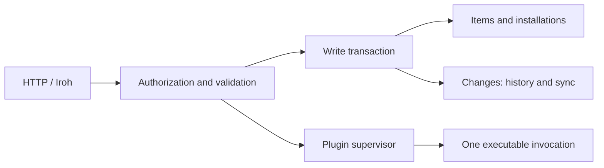

# Core architecture

The store has three persistent concepts:

| Concept | Storage | Responsibility |
|---|---|---|
| Item | `items` | A facet, JSON body, revision, timestamps, and last writer. Facet definitions and pairing sessions are items too. |
| Change | `changes` | An immutable item snapshot or core event, ordered by a durable cursor. The same rows serve history and synchronization. |
| Installation | `clients` | Durable, revocable authority tied to a browser commitment or Iroh identity. A signed capability bounds this authority; it does not replace it. |

The HTTP API performs authentication, authorization, and schema validation.
`store::Write` owns a database transaction and its source attribution. Its create,
update, and delete methods write the item and corresponding change together.
Pairing uses those same methods. Installation changes append their audit event in
the transaction that updates the registration. Dropping a failed transaction
rolls back both state and history.



## Ordering and subscriptions

Writers take item or installation locks before the shared append lock. They hold
the append lock until commit, keeping sequence order consistent with visibility.
Subscribers can therefore resume from one sequence number without missing slower
writers. PostgreSQL notifications wake subscribers; the change table supplies the
events and remains the source of truth after disconnects.

SSE subscriptions use a separate bounded connection pool for `LISTEN`. An idle
subscription cannot consume a request connection. Each event is checked against
current installation authority; idle streams also check expiry and revocation.

A tick appends its event and runs one SQL sweep across all facet lapse rules.
Lapses are deduplicated by item ID and revision. Transaction timestamps are not
edit identities: a writer that waited on a lock can start before the preceding
tick and still commit a new revision afterward.

## Schemas and processes

`schema::compile` checks local references and compiles schemas before either a
facet definition or plugin operation becomes usable. Invalid facet schema edits
leave the previous definition and its revision intact. Compiled facet validators
are cached by name and schema value.

Plugins have one supervisor owning the executable, stdin, stdout, stderr, and
concurrency permit. The deadline covers the whole invocation, including process
exit after stdout closes. Disconnects and failures reap the executable before
releasing capacity. Headers are bounded while being read; bodies stream with
backpressure. Plugin calls do not enter the item or change tables.

The Rust client similarly has one HTTP-over-QUIC response primitive. Buffered
requests, plugin output, and change subscriptions all share connection setup and
stream cleanup. Only safe reads retry after an ambiguous transport failure.

Both Android applications compile the same pairing, outbox, synchronization,
and JNI sources from `apps/android-shared`. Domain schemas, screens, storage
keys, and keystore aliases remain owned by each application. Sharing source
does not introduce a new runtime service or change JNI package names.

## Verification

The integration suites exercise real PostgreSQL, HTTP, Iroh/QUIC, CLI processes,
plugin executables, browsers, and Android APKs. Client retry tests forward to the
real core and deliberately drop a response after the operation commits, then
check the resulting database state. They do not fabricate server responses.
Small pure tests remain for parsing, permissions, cache projections, and domain
rules; network and persistence behavior is covered across the real boundaries.

With Docker available, run the Rust and launcher suites:

```sh
cargo test --locked --manifest-path erisdb/Cargo.toml
cargo test --locked --manifest-path erisdb-client/Cargo.toml
cargo test --locked --manifest-path clients/mcp/Cargo.toml
python3 tests/local/test_launcher.py
```

Run browser tests with `npm run test:e2e` after installing the npm dependencies
and Playwright Chromium. `ERISDB_CHROMIUM` can select an installed Chromium.
Build both Android apps with `scripts/build-android.sh`, start an isolated
emulator, then run `bash tests/android/run.sh`. The device suite covers real
pairing expiry and denial, offline queues across process restarts, revision
conflicts, narrowed authority, paginated synchronization, cache recovery,
credential renewal, CRUD, and revocation. It installs and clears the test apps.

The OpenAI plugin's live tool-call and streaming test is opt-in because it calls
the provider. Set `OPENAI_API_KEY` and `ERISDB_TEST_OPENAI_MODEL`, then run:

```sh
cargo test --locked --manifest-path erisdb/Cargo.toml --test openai_plugin -- --ignored
```

## Measuring implementation size

Compare production Rust and SQL with a specific prior revision:

```sh
python3 scripts/core-loc.py --base REVISION
python3 scripts/core-loc.py --base REVISION --format
```

Both commands use CLOC on `erisdb/src` and `erisdb/migrations`, excluding inline
unit-test modules from both snapshots. The second applies identical rustfmt
settings to temporary copies so changes in line wrapping do not explain the
result. Tests outside the core, generated code, and dependencies are excluded.
Neither command changes the working tree.

Count both Android applications and their shared implementation together:

```sh
cloc --skip-uniqueness apps/*-android/app/src/main/java \
  apps/android-shared/src/main/java apps/*-android/app/build.gradle.kts
```

The Gradle files and shared sources count toward the total. `--skip-uniqueness`
also counts separate identical files, such as the JNI bridge before sharing.
